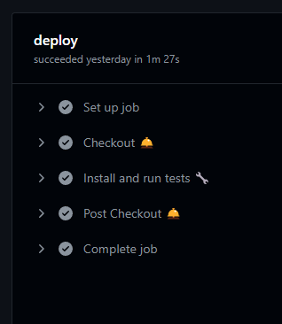

# Tip-calc  app

  
App version `0.1.5` is a web application that is responsible for calculating the tip of a shopping cart given the list
of some products

## Technical info

- This project was bootstrapped with [Create React App](https://github.com/facebook/create-react-app).
- For state management we are using flux architecture with `react-redux` version `8.0.2`
- For the handling of forms, the `react-hook-form` library is being used in its version `7.34.2`
- Styles with SASS
- The tests are run in a library called `jest`

### Moudules

- **assets**: All static files of the application
- **global**: In this package is what is going to be shared throughout the application, as well as all the state
  configuration with redux
- **modules**:
    - **check out**
        - **components**: All component segmentation of this module
        - **constants**: application constants
        - **layouts**: Sections with some functionality that encompass several view or business logic components
        - **pages**: Any section that determines a route
- **styles**: All global style files
- **tests**: Folder where the application tests are stored

## Available Scripts

In the project directory, you can run:

### `npm start`

Runs the app in the development mode.\
Open [http://localhost:3000](http://localhost:3000) to view it in the browser.

The page will reload if you make edits.\
You will also see any lint errors in the console.

### `npm test`

Launches the test runner in the interactive watch mode.\
See the section about [running tests](https://facebook.github.io/create-react-app/docs/running-tests) for more
information.

### `npm run build`

Builds the app for production to the `build` folder.\
It correctly bundles React in production mode and optimizes the build for the best performance.

The build is minified and the filenames include the hashes.\
Your app is ready to be deployed!

See the section about [deployment](https://facebook.github.io/create-react-app/docs/deployment) for more information.

## ci-cd

For the continuous integration of the project, github actios was implemented, which allows jobs to be run in the
project's pull request flow to validate syntax, and for unit tests to pass correctly

**This is set to:**

`.github/workflows/tests.yml`